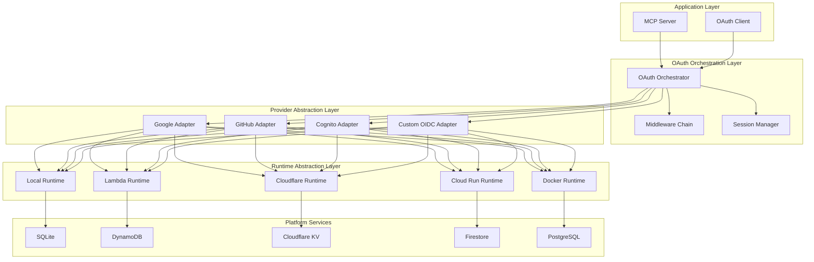

# Universal OAuth Architecture Design Document
## Multi-Platform MCP OAuth System

### Version 1.0 - January 2025

---

## Executive Summary

This document describes a comprehensive OAuth 2.0/OIDC architecture for the Rust MCP SDK that provides enterprise-grade authentication across multiple deployment platforms. The design enables developers to write OAuth logic once and deploy it seamlessly to local environments, AWS Lambda, Cloudflare Workers, Google Cloud Run, Docker containers, and traditional servers.

### Key Innovations

1. **Dual Abstraction Layers**: Provider abstraction (OAuth providers) + Runtime abstraction (deployment platforms)
2. **Platform-Optimal Performance**: Native execution where possible, WASM where required
3. **Configuration Portability**: Unified configuration across all platforms
4. **TypeScript SDK Feature Parity Plus**: Exceeds TypeScript SDK with provider adapters and middleware chains
5. **Production-Ready**: Handles real-world requirements like Cognito DCR proxy

---

## 1. Architecture Overview

### 1.1 Core Design Principles

| Principle | Description | Benefit |
|-----------|-------------|---------|
| **Write Once, Deploy Anywhere** | Single codebase for all platforms | Reduced maintenance, consistent behavior |
| **Platform-Native Optimization** | Use platform-specific services | Better performance, lower costs |
| **Graceful Degradation** | Features adapt to platform capabilities | Maximum compatibility |
| **Zero-Configuration Development** | Auto-detection of runtime environment | Faster development cycle |
| **Provider Extensibility** | Easy addition of new OAuth providers | Future-proof design |

### 1.2 High-Level Architecture



---

## 2. Provider Abstraction Layer

### 2.1 Core Provider Trait

```rust
/// Core trait that all OAuth providers must implement
#[async_trait]
pub trait OAuthProviderAdapter: Send + Sync {
    /// Provider metadata (issuer, endpoints, capabilities)
    fn metadata(&self) -> ProviderMetadata;
    
    /// Generate authorization URL with provider-specific parameters
    async fn authorize_url(&self, params: AuthorizeParams) -> Result<Url>;
    
    /// Exchange authorization code for tokens
    async fn exchange_code(
        &self,
        code: String,
        verifier: Option<String>,
        redirect_uri: String,
    ) -> Result<TokenResponse>;
    
    /// Refresh access token
    async fn refresh_token(&self, refresh_token: String) -> Result<TokenResponse>;
    
    /// Validate and introspect token
    async fn validate_token(&self, token: &str) -> Result<TokenClaims>;
    
    /// Provider-specific features
    fn capabilities(&self) -> ProviderCapabilities;
    
    // Optional: Dynamic Client Registration
    async fn register_client(&self, req: ClientRegistrationRequest) -> Result<ClientRegistrationResponse> {
        Err(Error::NotSupported("DCR not supported by this provider"))
    }
    
    // Optional: Token revocation
    async fn revoke_token(&self, token: &str, token_type_hint: Option<&str>) -> Result<()> {
        Err(Error::NotSupported("Token revocation not supported"))
    }
}

/// Provider capabilities declaration
pub struct ProviderCapabilities {
    pub supports_pkce: bool,
    pub supports_dcr: bool,
    pub supports_refresh: bool,
    pub supports_revocation: bool,
    pub supports_introspection: bool,
    pub max_token_lifetime: Duration,
    pub custom_scopes: Vec<String>,
}
```

### 2.2 Built-in Provider Implementations

#### 2.2.1 Google Provider

```rust
pub struct GoogleProvider {
    client_id: String,
    client_secret: Option<String>,
    discovery_document: Arc<RwLock<Option<DiscoveryDocument>>>,
    http_client: Arc<dyn HttpClient>,
}

impl GoogleProvider {
    pub async fn new(config: GoogleConfig) -> Result<Self> {
        // Auto-discover endpoints
        let discovery = Self::discover_endpoints().await?;
        // Initialize with Google-specific configuration
    }
    
    // Google-specific: Offline access for refresh tokens
    pub fn with_offline_access(mut self) -> Self {
        self.access_type = Some("offline");
        self
    }
}
```

#### 2.2.2 Cognito Provider with DCR Proxy

```rust
pub struct CognitoProvider {
    user_pool_id: String,
    region: String,
    domain: String,
    dcr_store: Arc<dyn DcrStore>,
    jwks_cache: Arc<JwksCache>,
}

impl CognitoProvider {
    // Implements DCR via proxy since Cognito doesn't support it natively
    async fn register_client(&self, req: ClientRegistrationRequest) -> Result<ClientRegistrationResponse> {
        // Determine if client is public (e.g., Claude Desktop)
        let is_public = self.is_public_client(&req.client_name);
        
        // Create Cognito app client
        let cognito_client = self.create_cognito_client(req, is_public).await?;
        
        // Store in DynamoDB for DCR compatibility
        self.dcr_store.store_client(cognito_client).await?;
        
        Ok(cognito_client)
    }
}
```

### 2.3 Provider Registry

```rust
/// Manages multiple OAuth providers
pub struct OAuthProviderRegistry {
    providers: HashMap<String, Arc<dyn OAuthProviderAdapter>>,
    default_provider: Option<String>,
}

impl OAuthProviderRegistry {
    /// Register a provider
    pub fn register(&mut self, name: impl Into<String>, provider: impl OAuthProviderAdapter + 'static) {
        self.providers.insert(name.into(), Arc::new(provider));
    }
    
    /// Load providers from configuration
    pub async fn from_config(config_path: &Path) -> Result<Self> {
        let config = load_config(config_path)?;
        let mut registry = Self::new();
        
        for (name, provider_config) in config.providers {
            let provider = ProviderFactory::create(&provider_config).await?;
            registry.register(name, provider);
        }
        
        Ok(registry)
    }
}
```

---

## 3. Runtime Abstraction Layer

### 3.1 Core Runtime Trait

```rust
/// Abstraction over platform-specific services
#[async_trait]
pub trait RuntimeAdapter: Send + Sync {
    type Storage: StorageBackend;
    type Cache: CacheBackend;
    type Http: HttpClient;
    type Crypto: CryptoProvider;
    
    fn storage(&self) -> &Self::Storage;
    fn cache(&self) -> &Self::Cache;
    fn http(&self) -> &Self::Http;
    fn crypto(&self) -> &Self::Crypto;
    
    /// Platform-specific initialization
    async fn initialize(&mut self) -> Result<()>;
    
    /// Platform-specific request handling
    async fn handle_request(&self, req: HttpRequest) -> Result<HttpResponse>;
    
    /// Platform metadata
    fn platform_info(&self) -> PlatformInfo;
}

pub struct PlatformInfo {
    pub name: &'static str,
    pub version: String,
    pub capabilities: PlatformCapabilities,
    pub limitations: Vec<String>,
}
```

### 3.2 Storage Abstraction

```rust
#[async_trait]
pub trait StorageBackend: Send + Sync {
    /// Key-value operations
    async fn get(&self, key: &str) -> Result<Option<Vec<u8>>>;
    async fn set(&self, key: &str, value: Vec<u8>, ttl: Option<Duration>) -> Result<()>;
    async fn delete(&self, key: &str) -> Result<()>;
    
    /// Batch operations
    async fn batch_get(&self, keys: &[String]) -> Result<HashMap<String, Vec<u8>>>;
    async fn batch_set(&self, items: HashMap<String, Vec<u8>>) -> Result<()>;
    
    /// Query operations
    async fn list_keys(&self, prefix: &str, limit: Option<usize>) -> Result<Vec<String>>;
    
    /// Transaction support (if available)
    async fn transaction<F, R>(&self, f: F) -> Result<R>
    where
        F: FnOnce(&mut Transaction) -> Result<R>;
}
```

### 3.3 Platform Implementations

#### 3.3.1 AWS Lambda Runtime

```rust
pub struct LambdaRuntime {
    storage: DynamoDBStorage,
    cache: ElastiCacheClient,
    http: AwsSdkHttp,
    crypto: RustCrypto,
    context: lambda_runtime::Context,
}

impl LambdaRuntime {
    pub async fn new() -> Result<Self> {
        // Initialize AWS SDK clients
        let config = aws_config::load_from_env().await;
        let dynamodb = aws_sdk_dynamodb::Client::new(&config);
        
        Ok(Self {
            storage: DynamoDBStorage::new(dynamodb, env::var("DCR_TABLE_NAME")?),
            cache: ElastiCacheClient::new(env::var("ELASTICACHE_ENDPOINT")?).await?,
            http: AwsSdkHttp::new(&config),
            crypto: RustCrypto::new(),
            context: Default::default(),
        })
    }
}

#[async_trait]
impl RuntimeAdapter for LambdaRuntime {
    type Storage = DynamoDBStorage;
    type Cache = ElastiCacheClient;
    type Http = AwsSdkHttp;
    type Crypto = RustCrypto;
    
    async fn handle_request(&self, req: HttpRequest) -> Result<HttpResponse> {
        // Lambda-specific request handling
        // Integrate with API Gateway event format
    }
}
```

#### 3.3.2 Cloudflare Workers Runtime

```rust
#[cfg(target_arch = "wasm32")]
pub struct CloudflareRuntime {
    storage: CloudflareKV,
    cache: CloudflareCache,
    http: FetchClient,
    crypto: WebCrypto,
    env: worker::Env,
}

impl CloudflareRuntime {
    pub fn new(env: worker::Env) -> Self {
        Self {
            storage: CloudflareKV::new(env.kv("OAUTH_CLIENTS")?),
            cache: CloudflareCache::new(),
            http: FetchClient::new(),
            crypto: WebCrypto::new(),
            env,
        }
    }
    
    /// Use Durable Objects for session state
    pub async fn get_session(&self, session_id: &str) -> Result<SessionState> {
        let namespace = self.env.durable_object("OAUTH_SESSIONS")?;
        let stub = namespace.id_from_string(session_id)?.get_stub()?;
        stub.fetch_json("/get", None).await
    }
}
```

#### 3.3.3 Local Development Runtime

```rust
pub struct LocalRuntime {
    storage: SqliteStorage,
    cache: InMemoryCache,
    http: ReqwestClient,
    crypto: RustCrypto,
    server: Option<axum::Server>,
}

impl LocalRuntime {
    pub async fn new(config: LocalConfig) -> Result<Self> {
        let db_path = config.db_path.unwrap_or_else(|| PathBuf::from("oauth.db"));
        
        Ok(Self {
            storage: SqliteStorage::new(&db_path).await?,
            cache: InMemoryCache::with_capacity(1000),
            http: ReqwestClient::new(),
            crypto: RustCrypto::new(),
            server: None,
        })
    }
    
    /// Run as standalone server for development
    pub async fn run_server(&mut self, addr: SocketAddr) -> Result<()> {
        let app = self.create_router();
        self.server = Some(
            axum::Server::bind(&addr)
                .serve(app.into_make_service())
        );
        self.server.as_ref().unwrap().await?;
        Ok(())
    }
}
```

---

## 4. Middleware System

### 4.1 Middleware Trait

```rust
#[async_trait]
pub trait OAuthMiddleware: Send + Sync {
    /// Pre-authorization hook
    async fn pre_authorize(&self, ctx: &mut AuthorizeContext) -> Result<()> {
        Ok(())
    }
    
    /// Post-token generation hook
    async fn post_token(&self, ctx: &mut TokenContext) -> Result<()> {
        Ok(())
    }
    
    /// Pre-revocation hook
    async fn pre_revoke(&self, ctx: &mut RevokeContext) -> Result<()> {
        Ok(())
    }
    
    /// Request validation
    async fn validate_request(&self, req: &HttpRequest) -> Result<()> {
        Ok(())
    }
}
```

### 4.2 Built-in Middleware

```rust
/// Rate limiting middleware
pub struct RateLimitMiddleware {
    limiter: Arc<RateLimiter>,
}

impl RateLimitMiddleware {
    pub fn new(requests_per_second: u32) -> Self {
        Self {
            limiter: Arc::new(RateLimiter::new(requests_per_second)),
        }
    }
}

/// Audit logging middleware
pub struct AuditLogMiddleware {
    logger: Arc<dyn AuditLogger>,
}

/// Custom claims injection
pub struct CustomClaimsMiddleware {
    claim_resolver: Arc<dyn ClaimResolver>,
}

/// Multi-factor authentication
pub struct MFAMiddleware {
    mfa_provider: Arc<dyn MFAProvider>,
}
```

---

## 5. Configuration System

### 5.1 Unified Configuration Format

```toml
# oauth_config.toml

[general]
issuer = "${OAUTH_ISSUER:-http://localhost:8080}"
default_provider = "cognito"

# Runtime configuration
[deployment]
platform = "auto"  # auto, local, lambda, cloudflare, cloud-run, docker
environment = "${ENVIRONMENT:-development}"

[deployment.local]
storage = "sqlite"
cache = "memory"
bind_address = "127.0.0.1:8080"
db_path = "./oauth.db"

[deployment.lambda]
storage = "dynamodb"
cache = "elasticache"
table_name = "${DCR_TABLE_NAME}"
function_name = "${LAMBDA_FUNCTION_NAME}"
elasticache_endpoint = "${ELASTICACHE_ENDPOINT}"

[deployment.cloudflare]
storage = "kv"
cache = "cache-api"
kv_namespace = "${CF_KV_NAMESPACE}"
durable_object_namespace = "${CF_DO_NAMESPACE}"

[deployment.cloud_run]
storage = "firestore"
cache = "memorystore"
project_id = "${GCP_PROJECT_ID}"
service_name = "${CLOUD_RUN_SERVICE}"

# Provider configurations
[providers.google]
type = "google"
client_id = "${GOOGLE_CLIENT_ID}"
client_secret = "${GOOGLE_CLIENT_SECRET}"
scopes = ["openid", "email", "profile"]
offline_access = true

[providers.github]
type = "github"
client_id = "${GITHUB_CLIENT_ID}"
client_secret = "${GITHUB_CLIENT_SECRET}"
scopes = ["user:email", "read:user"]

[providers.cognito]
type = "cognito"
user_pool_id = "${COGNITO_USER_POOL_ID}"
region = "${COGNITO_REGION}"
domain = "${COGNITO_DOMAIN}"
enable_dcr_proxy = true

[providers.custom_oidc]
type = "oidc"
issuer = "https://auth.example.com"
client_id = "${CUSTOM_CLIENT_ID}"
client_secret = "${CUSTOM_CLIENT_SECRET}"
discovery = true

# Middleware configuration
[middleware]
enabled = ["rate_limit", "audit_log", "cors"]

[middleware.rate_limit]
requests_per_second = 100
burst_size = 200

[middleware.audit_log]
level = "info"
include_tokens = false

[middleware.cors]
allowed_origins = ["*"]
allowed_methods = ["GET", "POST", "OPTIONS"]
max_age = 86400
```

---

## 6. OAuth Orchestrator

### 6.1 High-Level Orchestration

```rust
/// Main OAuth server orchestrator
pub struct OAuthServerOrchestrator {
    runtime: Box<dyn RuntimeAdapter>,
    providers: Arc<OAuthProviderRegistry>,
    middleware: MiddlewareChain,
    session_manager: Arc<dyn SessionManager>,
    config: OAuthConfig,
}

impl OAuthServerOrchestrator {
    /// Build from configuration
    pub async fn from_config(config_path: &Path) -> Result<Self> {
        let config = OAuthConfig::load(config_path)?;
        
        // Auto-detect runtime
        let runtime = RuntimeDetector::detect_and_create(&config).await?;
        
        // Load providers
        let providers = OAuthProviderRegistry::from_config(&config).await?;
        
        // Setup middleware
        let middleware = MiddlewareChain::from_config(&config)?;
        
        // Initialize session manager
        let session_manager = SessionManager::new(runtime.storage());
        
        Ok(Self {
            runtime: Box::new(runtime),
            providers: Arc::new(providers),
            middleware,
            session_manager: Arc::new(session_manager),
            config,
        })
    }
    
    /// Run the OAuth server
    pub async fn run(self) -> Result<()> {
        match self.runtime.platform_info().name {
            "local" => self.run_local().await,
            "lambda" => self.run_lambda().await,
            "cloudflare" => self.run_cloudflare().await,
            "cloud-run" => self.run_cloud_run().await,
            _ => Err(Error::UnsupportedPlatform),
        }
    }
}
```

### 6.2 Request Flow

```rust
impl OAuthServerOrchestrator {
    /// Handle authorization request
    pub async fn handle_authorize(&self, req: AuthorizeRequest) -> Result<AuthorizeResponse> {
        // Create context
        let mut ctx = AuthorizeContext::new(req);
        
        // Run pre-authorize middleware
        self.middleware.pre_authorize(&mut ctx).await?;
        
        // Get provider
        let provider = self.providers.get(&ctx.provider_name)?;
        
        // Generate authorization URL
        let auth_url = provider.authorize_url(ctx.into_params()).await?;
        
        // Store session state
        self.session_manager.create_session(ctx.state, ctx.pkce).await?;
        
        Ok(AuthorizeResponse::Redirect(auth_url))
    }
    
    /// Handle token exchange
    pub async fn handle_token_exchange(&self, req: TokenRequest) -> Result<TokenResponse> {
        // Create context
        let mut ctx = TokenContext::new(req);
        
        // Validate request
        self.middleware.validate_request(&ctx.request).await?;
        
        // Get provider
        let provider = self.providers.get(&ctx.provider_name)?;
        
        // Exchange code for tokens
        let tokens = match ctx.grant_type {
            GrantType::AuthorizationCode => {
                provider.exchange_code(
                    ctx.code,
                    ctx.code_verifier,
                    ctx.redirect_uri,
                ).await?
            },
            GrantType::RefreshToken => {
                provider.refresh_token(ctx.refresh_token).await?
            },
            _ => return Err(Error::UnsupportedGrantType),
        };
        
        // Run post-token middleware
        ctx.tokens = tokens;
        self.middleware.post_token(&mut ctx).await?;
        
        // Store tokens
        self.session_manager.store_tokens(&ctx.session_id, &ctx.tokens).await?;
        
        Ok(ctx.tokens)
    }
}
```

---

## 7. Deployment Patterns

### 7.1 Deployment Matrix

| Platform | Build Command | Deploy Command | Endpoint Format |
|----------|--------------|----------------|-----------------|
| **Local** | `cargo build --features local` | `cargo run` | `http://localhost:8080` |
| **Docker** | `docker build -t mcp-oauth .` | `docker run -p 8080:8080 mcp-oauth` | `http://container:8080` |
| **Lambda** | `cargo lambda build --release` | `cargo lambda deploy` | API Gateway URL |
| **Cloudflare** | `wrangler build` | `wrangler publish` | `https://oauth.workers.dev` |
| **Cloud Run** | `gcloud builds submit` | `gcloud run deploy` | `https://oauth-xyz.run.app` |

### 7.2 Platform-Specific Dockerfiles

#### Multi-stage Dockerfile for flexibility

```dockerfile
# Base builder
FROM rust:1.75 as builder
WORKDIR /app
COPY Cargo.toml Cargo.lock ./
COPY src ./src

# Local/Docker build
FROM builder as local-builder
RUN cargo build --release --features local

# Lambda build
FROM builder as lambda-builder
RUN cargo lambda build --release --features lambda

# Cloudflare build
FROM builder as cf-builder
RUN cargo install wrangler
RUN wrangler build --features cloudflare

# Runtime images
FROM debian:bookworm-slim as local-runtime
COPY --from=local-builder /app/target/release/oauth-server /usr/local/bin/
CMD ["oauth-server"]

FROM public.ecr.aws/lambda/provided:al2 as lambda-runtime
COPY --from=lambda-builder /app/target/lambda/oauth-server/bootstrap ${LAMBDA_RUNTIME_DIR}
CMD ["bootstrap"]
```

### 7.3 Infrastructure as Code

#### Terraform configuration for multi-cloud

```hcl
# variables.tf
variable "deployment_platform" {
  type = string
  default = "aws"
}

# AWS Lambda deployment
module "aws_oauth" {
  source = "./modules/aws"
  count = var.deployment_platform == "aws" ? 1 : 0
  
  function_name = "mcp-oauth-server"
  dynamodb_table = "oauth-clients"
  elasticache_cluster = "oauth-cache"
}

# Google Cloud Run deployment
module "gcp_oauth" {
  source = "./modules/gcp"
  count = var.deployment_platform == "gcp" ? 1 : 0
  
  service_name = "mcp-oauth-server"
  firestore_database = "oauth"
  memorystore_instance = "oauth-cache"
}

# Cloudflare Workers deployment
module "cf_oauth" {
  source = "./modules/cloudflare"
  count = var.deployment_platform == "cloudflare" ? 1 : 0
  
  worker_name = "mcp-oauth-server"
  kv_namespace = "OAUTH_CLIENTS"
  durable_objects = true
}
```

---

## 8. Testing Strategy

### 8.1 Unit Testing with Mocked Runtime

```rust
#[cfg(test)]
mod tests {
    use super::*;
    
    #[tokio::test]
    async fn test_oauth_flow_with_mock_runtime() {
        // Create mock runtime
        let runtime = MockRuntime::new();
        runtime.expect_storage_get()
            .returning(|_| Ok(Some(vec![])));
        
        // Create orchestrator with mock
        let orchestrator = OAuthServerOrchestrator::builder()
            .runtime(Box::new(runtime))
            .provider("test", MockProvider::new())
            .build();
        
        // Test authorization
        let auth_req = AuthorizeRequest {
            client_id: "test-client",
            redirect_uri: "http://localhost/callback",
            response_type: ResponseType::Code,
            scope: Some("openid profile"),
            state: Some("test-state"),
        };
        
        let response = orchestrator.handle_authorize(auth_req).await.unwrap();
        assert!(matches!(response, AuthorizeResponse::Redirect(_)));
    }
}
```

### 8.2 Integration Testing per Platform

```rust
#[cfg(all(test, feature = "integration"))]
mod integration_tests {
    #[tokio::test]
    #[cfg(feature = "local")]
    async fn test_local_deployment() {
        let server = LocalRuntime::new(LocalConfig::default()).await.unwrap();
        // Test with real SQLite
    }
    
    #[tokio::test]
    #[cfg(feature = "lambda")]
    async fn test_lambda_deployment() {
        // Use LocalStack for testing
        let runtime = LambdaRuntime::new_with_endpoint("http://localhost:4566").await.unwrap();
        // Test with LocalStack DynamoDB
    }
    
    #[tokio::test]
    #[cfg(target_arch = "wasm32")]
    async fn test_cloudflare_deployment() {
        // Use Miniflare for testing
        let runtime = CloudflareRuntime::new_test();
        // Test with Miniflare KV
    }
}
```

---

## 9. Migration Path

### 9.1 From TypeScript SDK

```typescript
// TypeScript SDK
const provider = new ProxyOAuthServerProvider({
  endpoints: {
    authorizationUrl: "https://auth.example.com/authorize",
    tokenUrl: "https://auth.example.com/token",
  },
  verifyAccessToken: async (token) => { /* ... */ },
  getClient: async (clientId) => { /* ... */ },
});
```

Becomes:

```rust
// Rust SDK
let provider = ProxyProvider::new(ProxyConfig {
    authorization_endpoint: "https://auth.example.com/authorize",
    token_endpoint: "https://auth.example.com/token",
    verify_token: Box::new(|token| async { /* ... */ }),
    get_client: Box::new(|client_id| async { /* ... */ }),
});
```

### 9.2 From Existing Rust Implementation

```rust
// Current implementation
let provider = InMemoryOAuthProvider::new("http://localhost:8080");

// New implementation - works on any platform
let orchestrator = OAuthServerOrchestrator::builder()
    .detect_runtime()  // Auto-detect platform
    .provider("default", InMemoryProvider::new())
    .build()
    .await?;
```

---

## 10. Security Considerations

### 10.1 Platform-Specific Security

| Platform | Security Feature | Implementation |
|----------|-----------------|----------------|
| **Lambda** | AWS IAM roles | Automatic credential rotation |
| **Cloudflare** | Workers KV encryption | Automatic at-rest encryption |
| **Cloud Run** | Google Cloud IAM | Service account authentication |
| **Docker** | Secrets management | Docker secrets or Vault integration |
| **Local** | File permissions | SQLite encryption |

### 10.2 Security Best Practices

1. **Token Storage**: Always encrypted at rest
2. **PKCE**: Mandatory for public clients
3. **JWKS Rotation**: Automatic key rotation support
4. **Rate Limiting**: Built-in DDoS protection
5. **Audit Logging**: Complete audit trail

---

## 11. Performance Optimizations

### 11.1 Platform-Specific Optimizations

```rust
/// Optimize for cold starts on Lambda
#[cfg(feature = "lambda")]
pub fn optimize_lambda() {
    // Pre-warm connections
    lazy_static! {
        static ref DYNAMODB: aws_sdk_dynamodb::Client = {
            let config = aws_config::load_from_env().await;
            aws_sdk_dynamodb::Client::new(&config)
        };
    }
}

/// Optimize for edge computing on Cloudflare
#[cfg(target_arch = "wasm32")]
pub fn optimize_cloudflare() {
    // Use edge caching
    cache.set_ttl(Duration::from_secs(300));
}
```

### 11.2 Caching Strategy

```rust
pub struct UniversalCache {
    strategy: CacheStrategy,
}

pub enum CacheStrategy {
    /// In-memory for local development
    Memory(DashMap<String, CachedItem>),
    
    /// Redis for Docker/Kubernetes
    Redis(redis::Client),
    
    /// ElastiCache for Lambda
    ElastiCache(elasticache::Client),
    
    /// Edge cache for Cloudflare
    Edge(worker::Cache),
    
    /// Memorystore for Cloud Run
    Memorystore(memorystore::Client),
}
```

---

## 12. Monitoring and Observability

### 12.1 Unified Metrics

```rust
pub trait MetricsCollector: Send + Sync {
    fn increment_counter(&self, name: &str, tags: &[(&str, &str)]);
    fn record_histogram(&self, name: &str, value: f64, tags: &[(&str, &str)]);
    fn record_gauge(&self, name: &str, value: f64, tags: &[(&str, &str)]);
}

// Platform-specific implementations
impl MetricsCollector for CloudWatchMetrics { /* ... */ }
impl MetricsCollector for CloudflareAnalytics { /* ... */ }
impl MetricsCollector for StackdriverMetrics { /* ... */ }
impl MetricsCollector for PrometheusMetrics { /* ... */ }
```

### 12.2 Distributed Tracing

```rust
pub struct UniversalTracing {
    backend: TracingBackend,
}

pub enum TracingBackend {
    XRay(aws_xray::Client),        // AWS Lambda
    CloudflareTracing(worker::Trace), // Cloudflare
    CloudTrace(cloud_trace::Client),  // Google Cloud Run
    Jaeger(jaeger::Client),         // Docker/Kubernetes
    Console(tracing_subscriber::fmt::Layer), // Local development
}
```

---

## 13. Future Enhancements

### 13.1 Roadmap

| Phase | Feature | Timeline |
|-------|---------|----------|
| **Phase 1** | Core provider implementations | Q1 2025 |
| **Phase 2** | Runtime abstraction layer | Q1 2025 |
| **Phase 3** | Platform-specific optimizations | Q2 2025 |
| **Phase 4** | Advanced features (WebAuthn, Passkeys) | Q3 2025 |
| **Phase 5** | Federation support (SAML, WS-Fed) | Q4 2025 |

### 13.2 Extensibility Points

1. **Custom Providers**: Implement `OAuthProviderAdapter`
2. **Custom Runtime**: Implement `RuntimeAdapter`
3. **Custom Middleware**: Implement `OAuthMiddleware`
4. **Custom Storage**: Implement `StorageBackend`
5. **Custom Metrics**: Implement `MetricsCollector`

---

## 14. Example Implementation

### 14.1 Complete Example

```rust
use pmcp_oauth::prelude::*;

#[tokio::main]
async fn main() -> Result<()> {
    // Load configuration
    let config_path = std::env::var("OAUTH_CONFIG")
        .unwrap_or_else(|_| "oauth_config.toml".to_string());
    
    // Create OAuth server
    let server = OAuthServerOrchestrator::builder()
        .config_file(&config_path)
        .detect_runtime()  // Auto-detect platform
        .with_provider("google", GoogleProvider::from_env()?)
        .with_provider("github", GitHubProvider::from_env()?)
        .with_provider("cognito", CognitoProvider::from_env()?)
        .with_middleware(RateLimitMiddleware::new(100))
        .with_middleware(AuditLogMiddleware::default())
        .build()
        .await?;
    
    // Run server (platform-specific)
    server.run().await?;
    
    Ok(())
}
```

### 14.2 MCP Server Integration

```rust
use pmcp::{Server, ToolHandler};
use pmcp_oauth::{OAuthServerOrchestrator, AuthContext};

struct ProtectedTool {
    oauth: Arc<OAuthServerOrchestrator>,
    required_scope: String,
}

#[async_trait]
impl ToolHandler for ProtectedTool {
    async fn handle(&self, args: Value, extra: RequestHandlerExtra) -> Result<Value> {
        // Validate OAuth token
        let auth_context = self.oauth.validate_request(&extra).await?;
        
        // Check required scope
        if !auth_context.has_scope(&self.required_scope) {
            return Err(Error::Forbidden("Insufficient scope"));
        }
        
        // Execute protected operation
        Ok(json!({
            "result": "success",
            "user": auth_context.user_id,
        }))
    }
}
```

---

## Conclusion

This architecture provides a production-ready, multi-platform OAuth solution that:

1. **Exceeds TypeScript SDK capabilities** with provider adapters and middleware
2. **Supports all major deployment platforms** with optimal performance
3. **Handles real-world requirements** like Cognito DCR proxy
4. **Enables write-once, deploy-anywhere** development
5. **Maintains platform-native performance** and cost optimization

The design is extensible, testable, and ready for enterprise deployment across the modern cloud ecosystem.