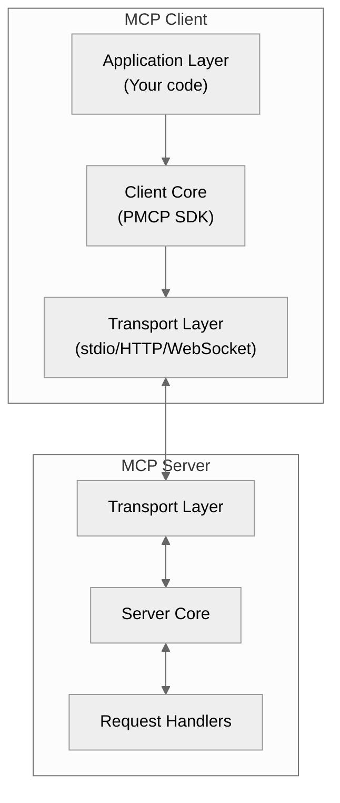

# Chapter 3: MCP Clients — Your Gateway to AI-Powered Applications

This chapter introduces MCP clients—the applications that connect to MCP servers to enable AI agents to use your tools, read your resources, and follow your prompts. Just as web browsers are the gateway to websites, MCP clients are the gateway to MCP servers.

The goal: after this chapter, you'll understand how MCP clients work, how to build your own testing and integration clients, and how professional AI applications like Claude Desktop, ChatGPT, and Cursor use the protocol.

## The Browser Analogy

If an MCP server is like a website (Chapter 4), then an MCP client is like a web browser or automated testing tool.

| Web ecosystem | MCP ecosystem | Purpose |
| --- | --- | --- |
| Chrome, Firefox, Safari, Edge | Claude Desktop, ChatGPT, Cursor, Co-Pilot | End-user applications that humans use |
| Selenium, Playwright, Puppeteer | MCP Tester, custom test clients | Automated testing and validation tools |
| cURL, Postman, HTTPie | Simple MCP clients, debugging tools | Developer tools for exploration and debugging |
| Browser DevTools | MCP Inspector | Protocol inspection and diagnostics |

Just as you have a handful of major browsers but millions of websites, the MCP ecosystem has a few major AI applications (clients) but will grow to have thousands of specialized servers providing domain-specific capabilities.

## Why Build an MCP Client?

While most developers will build **servers** to expose their capabilities, there are important reasons to understand and build **clients**:

- **Testing & Validation**: Verify your MCP servers work correctly before deploying
- **Integration**: Connect your own applications to MCP servers programmatically
- **Automation**: Build workflows that orchestrate multiple MCP servers
- **Custom UIs**: Create specialized interfaces for specific domains
- **Debugging**: Understand how clients interact with your servers

## Real-World MCP Clients

### Production Clients (The "Browsers")

These are the AI applications your users will interact with:

- **Claude Desktop**: Anthropic's official desktop application with native MCP support
- **ChatGPT**: OpenAI's conversational AI with plugin/extension support
- **GitHub Copilot**: Microsoft's AI coding assistant integrated into IDEs
- **Cursor**: AI-first code editor with deep MCP integration
- **Continue**: Open-source AI code assistant with MCP support

### Testing & Development Clients (The "Testing Tools")

**MCP Tester** (from this SDK) is like Selenium for MCP—a comprehensive testing tool that validates:
- Protocol compliance (JSON-RPC 2.0, MCP protocol versions)
- Server capabilities (tools, resources, prompts)
- Tool schemas and validation
- Performance and health monitoring
- Scenario-based testing with assertions

**WASM Client** (from this SDK) is like a browser-based Postman—runs entirely in the browser for:
- Interactive server exploration
- Quick debugging without installation
- Demos and documentation
- Testing CORS configurations
- Educational purposes

## Client Architecture Overview

An MCP client has three core responsibilities:

1. **Connection Management**: Establish and maintain the connection to a server
2. **Protocol Handling**: Implement JSON-RPC 2.0 and MCP protocol semantics
3. **Capability Negotiation**: Declare what features the client supports



ASCII fallback:
```
[Your Application Code]
         ↓
[MCP Client (PMCP SDK)]
         ↓
[Transport (stdio/HTTP/WebSocket)]
         ↕
[MCP Server Transport]
         ↓
[Server Core & Handlers]
```

## Building Your First Client

Let's start with the simplest possible client: connecting to a server and listing its capabilities.

### Step 1: Create and Initialize

```rust
use pmcp::{Client, ClientCapabilities, StdioTransport};

#[tokio::main]
async fn main() -> pmcp::Result<()> {
    // Create a client with stdio transport
    let transport = StdioTransport::new();
    let mut client = Client::new(transport);

    // Initialize the connection
    let server_info = client.initialize(ClientCapabilities::default()).await?;

    println!("Connected to: {} v{}",
             server_info.server_info.name,
             server_info.server_info.version);

    Ok(())
}
```

This is the MCP equivalent of opening a browser and navigating to a website. The `initialize` call is the handshake that establishes the connection.

### Step 2: Discover Capabilities

Once connected, you can discover what the server offers:

```rust
// Check what the server supports
if server_info.capabilities.provides_tools() {
    println!("Server has tools available");

    // List the tools
    let tools_result = client.list_tools(None).await?;

    for tool in tools_result.tools {
        println!("  • {}", tool.name);
        if let Some(desc) = tool.description {
            println!("    {}", desc);
        }
    }
}

if server_info.capabilities.provides_resources() {
    println!("Server has resources available");

    // List the resources
    let resources_result = client.list_resources(None).await?;

    for resource in resources_result.resources {
        println!("  • {} ({})", resource.name, resource.uri);
    }
}

if server_info.capabilities.provides_prompts() {
    println!("Server has prompts available");

    // List the prompts
    let prompts_result = client.list_prompts(None).await?;

    for prompt in prompts_result.prompts {
        println!("  • {}", prompt.name);
    }
}
```

This is equivalent to a browser rendering a website's navigation menu—you're exploring what's available before taking action.

### Step 3: Invoke Tools

Now you can call tools with arguments:

```rust
use serde_json::json;

// Call a tool with arguments
let result = client.call_tool(
    "search_products".to_string(),
    json!({
        "query": "laptop",
        "limit": 10
    })
).await?;

println!("Tool result: {}", serde_json::to_string_pretty(&result.content)?);
```

This is like submitting a form on a website—you provide structured input and receive a structured response.

### Step 4: Read Resources

Reading documentation or data:

```rust
// Read a resource by URI
let resource_result = client.read_resource(
    "docs://ordering/policies/v1".to_string()
).await?;

for content in resource_result.contents {
    if let Some(text) = content.text {
        println!("Policy content:\n{}", text);
    }
}
```

### Step 5: Error Handling

Always handle errors gracefully:

```rust
match client.call_tool("create_order".to_string(), args).await {
    Ok(result) => {
        println!("Success: {:?}", result);
    }
    Err(e) => {
        eprintln!("Error: {}", e);

        // Check for specific error codes
        if let Some(code) = e.error_code() {
            match code {
                pmcp::ErrorCode::INVALID_PARAMS => {
                    eprintln!("Invalid arguments provided (error -32602)");
                }
                pmcp::ErrorCode::METHOD_NOT_FOUND => {
                    eprintln!("Tool not found (error -32601)");
                }
                _ => eprintln!("Error code: {}", code.as_i32())
            }
        }
    }
}
```

## Real-World Example: MCP Tester

The **MCP Tester** is a production-quality client built with the PMCP SDK. It demonstrates advanced client patterns and best practices.

### Installation

```bash
cd examples/26-server-tester
cargo build --release

# The binary will be at target/release/mcp-tester
```

### Basic Usage

```bash
# Quick connectivity check
mcp-tester test http://localhost:8080

# Full test suite with tool validation
mcp-tester test http://localhost:8080 --with-tools

# Protocol compliance validation
mcp-tester compliance http://localhost:8080 --strict

# List and validate tools
mcp-tester tools http://localhost:8080 --test-all

# Generate automated test scenarios
mcp-tester generate-scenario http://localhost:8080 -o tests.yaml --all-tools

# Run test scenarios
mcp-tester scenario http://localhost:8080 tests.yaml --detailed
```

### How MCP Tester Works

The tester demonstrates key client patterns:

**1. Multi-Transport Support**

```rust
// Automatically detect transport from URL
pub struct ServerTester {
    url: String,
    client: Option<Client>,
    timeout: Duration,
}

impl ServerTester {
    pub fn new(
        url: &str,
        timeout: Duration,
        insecure: bool,
        api_key: Option<&str>,
        transport: Option<&str>,
    ) -> pmcp::Result<Self> {
        // Parse URL to determine transport type
        if url.starts_with("http://") || url.starts_with("https://") {
            // Use HTTP transport
        } else if url.starts_with("ws://") || url.starts_with("wss://") {
            // Use WebSocket transport
        } else if url == "stdio" {
            // Use stdio transport
        }
        // ...
    }
}
```

**2. Capability Discovery and Validation**

```rust
pub async fn run_full_suite(&mut self, with_tools: bool) -> pmcp::Result<TestReport> {
    let mut report = TestReport::new();

    // Initialize connection
    let init_result = self.test_initialize().await?;
    report.add_test(init_result);

    // Test tool discovery
    if self.server_supports_tools() {
        let tools_result = self.test_list_tools().await?;
        report.add_test(tools_result);

        if with_tools {
            // Test each tool individually
            for tool in &self.discovered_tools {
                let test_result = self.test_tool_validation(&tool.name).await?;
                report.add_test(test_result);
            }
        }
    }

    // Test resource discovery
    if self.server_supports_resources() {
        let resources_result = self.test_list_resources().await?;
        report.add_test(resources_result);
    }

    // Test prompt discovery
    if self.server_supports_prompts() {
        let prompts_result = self.test_list_prompts().await?;
        report.add_test(prompts_result);
    }

    Ok(report)
}
```

**3. Schema Validation**

The tester validates tool JSON schemas to catch common mistakes:

```rust
fn validate_tool_schema(tool: &ToolInfo) -> Vec<String> {
    let mut warnings = Vec::new();

    // Check for empty schema
    if tool.input_schema.is_null() || tool.input_schema == json!({}) {
        warnings.push(format!(
            "Tool '{}' has empty input schema - consider defining parameters",
            tool.name
        ));
    }

    // Check for missing properties in object schema
    if let Some(obj) = tool.input_schema.as_object() {
        if obj.get("type") == Some(&json!("object")) {
            if !obj.contains_key("properties") {
                warnings.push(format!(
                    "Tool '{}' missing 'properties' field for object type",
                    tool.name
                ));
            }
        }
    }

    warnings
}
```

**4. Scenario-Based Testing**

Generate test scenarios automatically:

```rust
pub async fn generate_scenario(
    tester: &mut ServerTester,
    output: &str,
    all_tools: bool,
) -> pmcp::Result<()> {
    // Initialize and discover capabilities
    tester.initialize().await?;
    let tools = tester.list_tools().await?;

    let mut scenario = TestScenario {
        name: format!("{} Test Scenario", tester.server_name()),
        description: "Automated test scenario".to_string(),
        timeout: 60,
        steps: vec![],
    };

    // Add tools list step
    scenario.steps.push(ScenarioStep {
        name: "List available capabilities".to_string(),
        operation: Operation::ListTools,
        assertions: vec![
            Assertion::Success,
            Assertion::Exists { path: "tools".to_string() },
        ],
        ..Default::default()
    });

    // Add a test step for each tool
    let tools_to_test = if all_tools { tools.len() } else { 3.min(tools.len()) };

    for tool in tools.iter().take(tools_to_test) {
        let args = generate_sample_args(&tool.input_schema)?;

        scenario.steps.push(ScenarioStep {
            name: format!("Test tool: {}", tool.name),
            operation: Operation::ToolCall {
                tool: tool.name.clone(),
                arguments: args,
            },
            assertions: vec![Assertion::Success],
            timeout: Some(30),
            continue_on_failure: true,
            ..Default::default()
        });
    }

    // Write to file
    let yaml = serde_yaml::to_string(&scenario)?;
    std::fs::write(output, yaml)?;

    println!("✅ Generated scenario: {}", output);
    Ok(())
}
```

### Testing with MCP Tester: A Complete Workflow

```bash
# Step 1: Start your MCP server
cargo run --example 02_server_basic &

# Step 2: Quick health check
mcp-tester quick http://localhost:8080

# Step 3: Run full test suite
mcp-tester test http://localhost:8080 --with-tools --format json > results.json

# Step 4: Generate comprehensive test scenarios
mcp-tester generate-scenario http://localhost:8080 \
  -o my-server-tests.yaml \
  --all-tools \
  --with-resources \
  --with-prompts

# Step 5: Edit generated scenarios (replace TODOs with real data)
vim my-server-tests.yaml

# Step 6: Run scenario tests
mcp-tester scenario http://localhost:8080 my-server-tests.yaml --detailed

# Step 7: Compare with another server implementation
mcp-tester compare http://localhost:8080 http://staging.example.com --with-perf
```

## Real-World Example: WASM Client (Browser-Based)

The **WASM Client** demonstrates how to build MCP clients that run entirely in the browser—perfect for documentation, demos, and educational purposes.

### Why a Browser Client?

- **Zero Installation**: Users can test your MCP server without installing anything
- **Interactive Documentation**: Let users explore your APIs directly from docs
- **Debugging UI**: Visual interface for understanding protocol exchanges
- **CORS Testing**: Verify your server's browser compatibility
- **Educational Tool**: Show how MCP works in real-time

### Building and Running

```bash
# Navigate to the WASM client directory
cd examples/wasm-client

# Build the WASM module
bash build.sh

# Serve the client
python3 -m http.server 8000

# Open in browser
open http://localhost:8000
```

### Architecture

The WASM client uses browser APIs for transport:

```rust
use wasm_bindgen::prelude::*;
use web_sys::{Request, RequestInit, Response};

#[wasm_bindgen]
pub struct WasmClient {
    url: String,
    client: Option<Client>,
}

#[wasm_bindgen]
impl WasmClient {
    #[wasm_bindgen(constructor)]
    pub fn new() -> Self {
        // Initialize logging for browser console
        console_error_panic_hook::set_once();

        Self {
            url: String::new(),
            client: None,
        }
    }

    /// Connect to an MCP server (auto-detects HTTP or WebSocket)
    #[wasm_bindgen]
    pub async fn connect(&mut self, url: String) -> Result<JsValue, JsValue> {
        self.url = url.clone();

        // Auto-detect transport based on URL scheme
        let transport = if url.starts_with("ws://") || url.starts_with("wss://") {
            // Use WebSocket transport (browser WebSocket API)
            WasmWebSocketTransport::new(&url)?
        } else {
            // Use HTTP transport (browser Fetch API)
            WasmHttpTransport::new(&url)?
        };

        let mut client = Client::new(transport);

        // Initialize with default capabilities
        let server_info = client
            .initialize(ClientCapabilities::default())
            .await
            .map_err(|e| JsValue::from_str(&e.to_string()))?;

        self.client = Some(client);

        // Return server info as JSON
        Ok(serde_wasm_bindgen::to_value(&server_info)?)
    }

    /// List available tools
    #[wasm_bindgen]
    pub async fn list_tools(&mut self) -> Result<JsValue, JsValue> {
        let client = self.client.as_mut()
            .ok_or_else(|| JsValue::from_str("Not connected"))?;

        let tools = client
            .list_tools(None)
            .await
            .map_err(|e| JsValue::from_str(&e.to_string()))?;

        Ok(serde_wasm_bindgen::to_value(&tools.tools)?)
    }

    /// Call a tool with arguments
    #[wasm_bindgen]
    pub async fn call_tool(
        &mut self,
        name: String,
        args: JsValue
    ) -> Result<JsValue, JsValue> {
        let client = self.client.as_mut()
            .ok_or_else(|| JsValue::from_str("Not connected"))?;

        // Convert JS args to serde_json::Value
        let args_value: serde_json::Value =
            serde_wasm_bindgen::from_value(args)?;

        let result = client
            .call_tool(name, args_value)
            .await
            .map_err(|e| JsValue::from_str(&e.to_string()))?;

        Ok(serde_wasm_bindgen::to_value(&result)?)
    }
}
```

### Browser Integration

Use the WASM client from JavaScript:

```javascript
import init, { WasmClient } from './pkg/mcp_wasm_client.js';

async function testMcpServer() {
    // Initialize WASM module
    await init();

    // Create client
    const client = new WasmClient();

    // Connect to server (auto-detects transport)
    try {
        const serverInfo = await client.connect('http://localhost:8081');
        console.log('Connected:', serverInfo);

        // List tools
        const tools = await client.list_tools();
        console.log('Available tools:', tools);

        // Call a tool
        const result = await client.call_tool('echo', {
            message: 'Hello from browser!'
        });
        console.log('Result:', result);

    } catch (error) {
        console.error('Error:', error);
    }
}
```

### Use Cases

**1. Interactive Documentation**

Embed the WASM client in your API docs:

```html
<div id="mcp-playground">
    <h3>Try it live!</h3>
    <button onclick="connectAndTest()">Test the API</button>
    <pre id="output"></pre>
</div>

<script type="module">
    import init, { WasmClient } from './mcp_wasm_client.js';

    let client;

    window.connectAndTest = async function() {
        await init();
        client = new WasmClient();

        const output = document.getElementById('output');
        output.textContent = 'Connecting...';

        try {
            await client.connect('https://api.example.com/mcp');
            const tools = await client.list_tools();
            output.textContent = JSON.stringify(tools, null, 2);
        } catch (e) {
            output.textContent = 'Error: ' + e;
        }
    };
</script>
```

**2. Debugging UI**

Build a visual protocol inspector:

```javascript
async function debugProtocol() {
    await init();
    const client = new WasmClient();

    // Log all protocol exchanges
    client.on('send', (msg) => {
        console.log('→ Client sent:', msg);
        appendToLog('out', msg);
    });

    client.on('receive', (msg) => {
        console.log('← Server sent:', msg);
        appendToLog('in', msg);
    });

    await client.connect('ws://localhost:8080');
}
```

**3. Server Comparison Tool**

Compare multiple MCP servers side-by-side:

```javascript
async function compareServers() {
    await init();

    const servers = [
        'http://localhost:8080',
        'http://staging.example.com',
        'https://prod.example.com'
    ];

    const results = await Promise.all(
        servers.map(async (url) => {
            const client = new WasmClient();
            await client.connect(url);
            const tools = await client.list_tools();
            return { url, tools };
        })
    );

    displayComparison(results);
}
```

## Client Best Practices

### 1. Connection Management

**Always initialize before use:**

```rust
let mut client = Client::new(transport);
let server_info = client.initialize(capabilities).await?;

// Now the client is ready for requests
```

**Handle connection failures gracefully:**

```rust
use pmcp::Error;

match client.initialize(capabilities).await {
    Ok(info) => {
        // Store server capabilities for later use
        self.server_capabilities = info.capabilities;
    }
    Err(Error::Transport(e)) => {
        eprintln!("Transport error: {}", e);
        // Retry with exponential backoff
    }
    Err(Error::Timeout(_)) => {
        eprintln!("Server took too long to respond");
        // Increase timeout or fail
    }
    Err(e) => {
        eprintln!("Initialization failed: {}", e);
        return Err(e);
    }
}
```

### 2. Capability Negotiation

**Declare only what you need:**

```rust
let capabilities = ClientCapabilities {
    // Only request tools if you'll use them
    tools: Some(pmcp::types::ToolCapabilities::default()),

    // Don't request sampling if your client doesn't support LLM calls
    sampling: None,

    ..Default::default()
};
```

**Check server capabilities before use:**

```rust
if !server_info.capabilities.provides_tools() {
    eprintln!("Server doesn't support tools");
    return Err("Missing required capability".into());
}
```

### 3. Error Handling

**Distinguish between error types:**

```rust
use pmcp::{Error, ErrorCode};

match client.call_tool(name, args).await {
    Ok(result) => Ok(result),
    Err(Error::Protocol { code, message, .. }) => {
        match code {
            ErrorCode::INVALID_PARAMS => {
                // User error - fix arguments (JSON-RPC -32602)
                Err(format!("Invalid args: {}", message))
            }
            ErrorCode::METHOD_NOT_FOUND => {
                // Tool doesn't exist - check name (JSON-RPC -32601)
                Err(format!("Tool not found: {}", name))
            }
            ErrorCode::INTERNAL_ERROR => {
                // Server error - retry or escalate (JSON-RPC -32603)
                Err(format!("Server error: {}", message))
            }
            _ => Err(format!("Protocol error {} ({}): {}", code, code.as_i32(), message))
        }
    }
    Err(Error::Timeout(ms)) => {
        // Network/performance issue
        Err(format!("Request timed out after {}ms", ms))
    }
    Err(Error::Transport(e)) => {
        // Connection issue
        Err(format!("Connection lost: {}", e))
    }
    Err(e) => Err(format!("Unexpected error: {}", e))
}
```

### 4. Request Validation

**Validate inputs before sending:**

```rust
fn validate_tool_args(
    tool: &ToolInfo,
    args: &serde_json::Value,
) -> pmcp::Result<()> {
    // Check args match schema
    let schema = &tool.input_schema;

    if let Some(required) = schema.get("required").and_then(|v| v.as_array()) {
        for field in required {
            if let Some(field_name) = field.as_str() {
                if !args.get(field_name).is_some() {
                    return Err(pmcp::Error::validation(
                        format!("Missing required field: {}", field_name)
                    ));
                }
            }
        }
    }

    Ok(())
}
```

### 5. Logging and Debugging

**Enable protocol-level logging during development:**

```rust
// Initialize tracing for detailed protocol logs
tracing_subscriber::fmt()
    .with_env_filter("pmcp=debug")
    .init();

// Now all client requests/responses are logged
let result = client.call_tool(name, args).await?;
```

**Log important events:**

```rust
tracing::info!("Connecting to server: {}", url);
tracing::debug!("Sending tool call: {} with args: {:?}", name, args);
tracing::warn!("Server returned warning: {}", warning);
tracing::error!("Failed to call tool: {}", error);
```

### 6. Performance Considerations

**Use connection pooling for multiple servers:**

```rust
use std::collections::HashMap;

struct ClientPool {
    clients: HashMap<String, Client>,
}

impl ClientPool {
    async fn get_or_create(&mut self, url: &str) -> pmcp::Result<&mut Client> {
        if !self.clients.contains_key(url) {
            let transport = create_transport(url)?;
            let mut client = Client::new(transport);
            client.initialize(ClientCapabilities::default()).await?;
            self.clients.insert(url.to_string(), client);
        }

        Ok(self.clients.get_mut(url).unwrap())
    }
}
```

**Batch requests when possible:**

```rust
// Instead of multiple sequential calls:
// Bad: 3 round trips
let tool1 = client.call_tool("tool1", args1).await?;
let tool2 = client.call_tool("tool2", args2).await?;
let tool3 = client.call_tool("tool3", args3).await?;

// Better: Parallel execution if tools are independent
let (tool1, tool2, tool3) = tokio::join!(
    client.call_tool("tool1", args1),
    client.call_tool("tool2", args2),
    client.call_tool("tool3", args3),
);
```

### 7. Security

**Validate server certificates in production:**

```rust
// Development: might skip cert validation
let transport = HttpTransport::new(url)
    .insecure(true); // ONLY for development!

// Production: always validate certificates
let transport = HttpTransport::new(url); // Validates by default
```

**Use API keys securely:**

```rust
// Don't hardcode keys
// Bad:
let api_key = "sk-1234567890abcdef";

// Good: Use environment variables
let api_key = std::env::var("MCP_API_KEY")
    .expect("MCP_API_KEY must be set");

let transport = HttpTransport::new(url)
    .with_api_key(&api_key);
```

## Transport Types

### stdio Transport

Best for: Local servers, subprocess communication, testing

```rust
use pmcp::StdioTransport;

let transport = StdioTransport::new();
let mut client = Client::new(transport);
```

**Use cases:**
- IDE plugins (VS Code, Cursor)
- CLI tools
- Local testing
- Process-to-process communication

### HTTP Transport

Best for: Remote servers, cloud deployments, stateless clients

```rust
use pmcp::HttpTransport;

let transport = HttpTransport::new("http://localhost:8080")?;
let mut client = Client::new(transport);
```

**Use cases:**
- Serverless functions (AWS Lambda, Vercel)
- Microservices architectures
- Cloud deployments
- Load-balanced servers

### WebSocket Transport

Best for: Real-time communication, bidirectional updates, long-lived connections

```rust
use pmcp::WebSocketTransport;

let transport = WebSocketTransport::connect("ws://localhost:8080").await?;
let mut client = Client::new(transport);
```

**Use cases:**
- Real-time dashboards
- Collaborative tools
- Streaming responses
- Progress notifications

## Testing Your Own Clients

Use the MCP Tester to validate your client implementation:

```bash
# Start a known-good reference server
cargo run --example 02_server_basic &

# Test your client against it
# Your client should handle all these scenarios

# 1. Basic connectivity
mcp-tester quick http://localhost:8080

# 2. Protocol compliance
mcp-tester compliance http://localhost:8080 --strict

# 3. All capabilities
mcp-tester test http://localhost:8080 --with-tools

# 4. Error handling
mcp-tester test http://localhost:8080 --tool nonexistent_tool

# 5. Performance
mcp-tester test http://localhost:8080 --timeout 5
```

## Debugging Checklist

When your client isn't working:

### Connection Issues

```bash
# 1. Verify the server is running
curl -X POST http://localhost:8080 -d '{"jsonrpc":"2.0","method":"initialize"}'

# 2. Check network connectivity
mcp-tester diagnose http://localhost:8080 --network

# 3. Verify transport compatibility
mcp-tester test http://localhost:8080 --transport http
```

### Protocol Issues

```rust
// Enable debug logging
tracing_subscriber::fmt()
    .with_env_filter("pmcp=trace")
    .init();

// Check for protocol violations
// - Is Content-Type correct? (application/json)
// - Are JSON-RPC fields present? (jsonrpc, method, id)
// - Is the MCP protocol version supported?
```

### Tool Call Failures

```bash
# Validate tool exists
mcp-tester tools http://localhost:8080

# Check schema requirements
mcp-tester tools http://localhost:8080 --verbose

# Test with known-good arguments
mcp-tester test http://localhost:8080 --tool tool_name --args '{}'
```

## Where To Go Next

- **Tools & Tool Handlers** (Chapter 5): Deep dive into tools
- **Resources & Resource Management** (Chapter 6): Working with resources
- **Prompts & Templates** (Chapter 7): Using prompts effectively
- **Error Handling & Recovery** (Chapter 8): Robust error handling
- **Transport Layers** (Chapter 10): Advanced transport configurations
- **Testing & Quality Assurance** (Chapter 15): Comprehensive testing strategies

## Summary

MCP clients are your gateway to the MCP ecosystem:

- **Like browsers**, they connect users to servers
- **Like testing tools**, they validate server implementations
- **Like curl**, they enable debugging and exploration

Key takeaways:

1. **Initialize first**: Always call `client.initialize()` before use
2. **Check capabilities**: Verify the server supports what you need
3. **Handle errors**: Distinguish between protocol, transport, and application errors
4. **Use the right transport**: stdio for local, HTTP for cloud, WebSocket for real-time
5. **Test thoroughly**: Use MCP Tester to validate your implementations
6. **Debug visually**: Use WASM Client for interactive exploration

The PMCP SDK makes building clients straightforward—whether you're building production AI applications or testing tools. Start simple with the examples, then expand to your use case.
