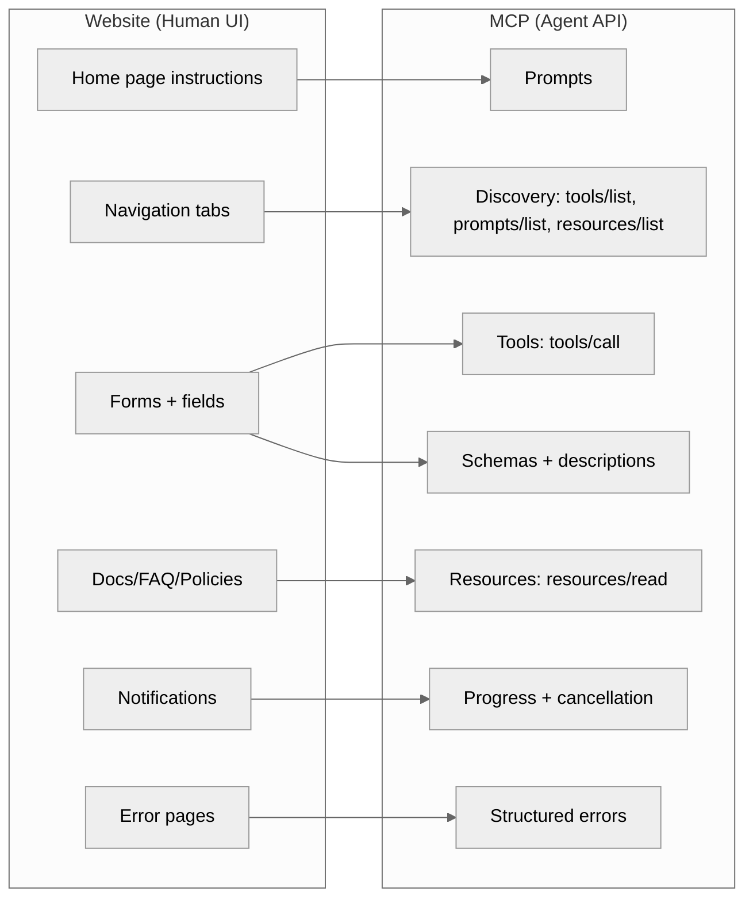
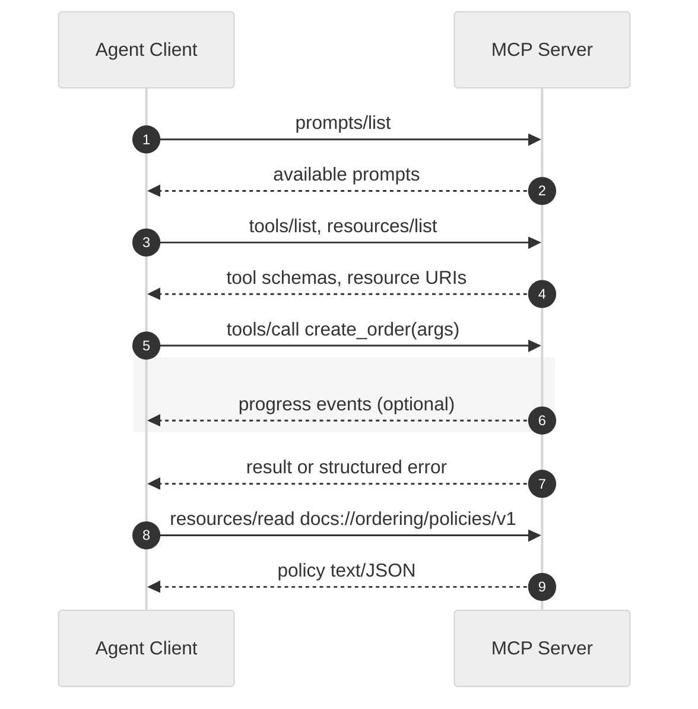

# Chapter 4: Protocol Basics — Think Like A Website

This chapter builds intuition for MCP by mapping it to something every product team already understands: a website. Where a website is designed for humans, an MCP server is the “website for AI agents.” The same product thinking applies — navigation, forms, docs, and clear instructions — but expressed as protocol surfaces that agents can reliably use at machine speed.

The goal: after this chapter, you’ll know why every business that ships a website or app will likely ship an MCP server too, and how to design one that agents can understand and operate safely.

## A Familiar Analogy

| Website element | MCP primitive | Purpose for agents |
| --- | --- | --- |
| Home page instructions | Prompts | Set expectations, goals, and usage patterns for the agent |
| Navigation tabs | Capability discovery | Show what exists: tools, prompts, resources |
| Forms with fields | Tools (actions) | Perform operations with validated, typed arguments |
| Form labels/help text | Tool schema + descriptions | Guide correct input and communicate constraints |
| Docs/FAQ/Policies | Resources | Provide reference material the agent can read and cite |
| Notifications/toasts | Progress and events | Communicate long-running work, partial results, and completion |
| Error pages | Structured errors | Tell the agent what failed and how to fix it |

If you’ve ever improved conversions by clarifying a form label or reorganizing navigation, you already understand “XU” (the agent eXperience). Great MCP servers are great at XU.

## Visual Model



## Why Build An MCP Server

- Speed: Agents operate your product without brittle scraping or slow human UI paths.
- Reliability: Strong typing and schemas reduce ambiguity and retries.
- Governance: You decide what’s allowed, audited, and measured.
- Reuse: The same server powers many agent clients, models, and runtimes.

## Core Surfaces Of The Protocol

At a high level, an MCP client connects to a server over a transport (stdio, WebSocket, or HTTP) and uses JSON-RPC methods to discover capabilities and execute actions.

- Discovery: list what exists
  - `tools/list` — enumerate available tools (your “forms”).
  - `prompts/list` and `prompts/get` — list and fetch prompt templates (your “home page instructions”).
  - `resources/list` — enumerate reference documents and data sets (your “docs”).

- Action: do work
  - `tools/call` — submit a tool with arguments (like submitting a form).

- Reading: consult context
  - `resources/read` — read a resource by id; may return text, JSON, or other content types.

- Feedback: keep the loop tight
  - Progress and cancellation — communicate long tasks and allow interruption (see Chapter 12).
  - Structured errors — explain what failed with machine-actionable details.

You’ll go deeper on each surface in Chapters 5–8. Here we focus on the mental model and design guidance that makes servers easy for agents to use.

## Designing For XU (Agent eXperience)

Treat agents like highly efficient, literal users. Design with the same rigor you would for a public-facing product.

- Clear names: Prefer verbs and domain terms (`create_order`, `refund_payment`).
- Tight schemas: Mark required vs optional, use enums, bounds, patterns, and example values.
- Helpful descriptions: Document constraints (currency, time zone, rate limits) where the agent needs them.
- Idempotency: Make retries safe; include idempotency keys where appropriate.
- Determinism first: Avoid side effects that depend on hidden state whenever possible.
- Predictable errors: Use specific error codes/messages and suggest next actions.
- Resource-first docs: Publish policies, SLAs, product catalogs, and changelogs as `resources/*`.
- Versioning: Introduce new tools instead of silently changing semantics; deprecate old ones gently.

## End-to-End Flow (Website Lens)

1) Land on “home” → The agent discovers `prompts` and reads guidance on how to use the server.

2) Browse navigation → The agent calls `tools/list`, `resources/list`, and optionally `prompts/list` to map the surface area.

3) Open a form → The agent selects a tool, reads its schema and descriptions, and prepares arguments.

4) Submit the form → The agent calls `tools/call` with structured arguments.

5) Watch progress → The server emits progress updates and finally returns a result or error.

6) Read the docs → The agent calls `resources/read` to consult policies, FAQs, or domain data.

7) Recover gracefully → On error, the agent adjusts inputs based on structured feedback and retries.

### Sequence Walkthrough



## Minimal JSON Examples

List tools (like “navigation tabs”):

```json
{ "method": "tools/list", "params": {} }
```

Call a tool (like submitting a form):

```json
{
  "method": "tools/call",
  "params": {
    "name": "create_order",
    "arguments": {
      "customer_id": "cus_123",
      "items": [
        { "sku": "SKU-42", "qty": 2 },
        { "sku": "SKU-99", "qty": 1 }
      ],
      "currency": "USD"
    }
  }
}
```

Read a resource (like opening docs):

```json
{
  "method": "resources/read",
  "params": { "uri": "docs://ordering/policies/v1" }
}
```

## Bootstrap With PMCP (Rust)

Here’s a sketch of a website-like MCP server using PMCP. We’ll add full coverage of tools, resources, and prompts in later chapters; this snippet focuses on the “forms” (tools) first.

```rust
use pmcp::{Server, ToolHandler, RequestHandlerExtra, Result};
use serde_json::{json, Value};
use async_trait::async_trait;

// Form 1: Search products
struct SearchProducts;

#[async_trait]
impl ToolHandler for SearchProducts {
    async fn handle(&self, args: Value, _extra: RequestHandlerExtra) -> Result<Value> {
        let query = args.get("query").and_then(|v| v.as_str()).unwrap_or("");
        let limit = args.get("limit").and_then(|v| v.as_u64()).unwrap_or(10);

        // In a real server, query your catalog here.
        Ok(json!({
            "content": [{ "type": "text", "text": format!(
                "Found results for '{}' (limit {})", query, limit
            )}],
            "isError": false
        }))
    }
}

// Form 2: Create order
struct CreateOrder;

#[async_trait]
impl ToolHandler for CreateOrder {
    async fn handle(&self, args: Value, _extra: RequestHandlerExtra) -> Result<Value> {
        // Validate required fields (ids, items, currency, etc.)
        if args.get("customer_id").and_then(|v| v.as_str()).is_none() {
            return Err(pmcp::Error::validation("Missing 'customer_id'"));
        }
        // Normally you would validate items/currency and write to storage.

        Ok(json!({
            "content": [{ "type": "text", "text": "Order created (demo)" }],
            "isError": false
        }))
    }
}

#[tokio::main]
async fn main() -> Result<()> {
    let server = Server::builder()
        .name("website-like-server")
        .version("0.1.0")
        .tool("search_products", SearchProducts)
        .tool("create_order", CreateOrder)
        .build()?;

    server.run_stdio().await
}
```

As you evolve this server, bake in XU:

- Add precise schemas and descriptions to each tool (Chapter 5).
- Publish a small set of reference docs as `resources/*` with stable URIs (Chapter 6).
- Provide starter prompts that teach the agent ideal workflows (Chapter 7).
- Return actionable errors and support progress/cancellation for long tasks (Chapters 8 and 12).

## Checklist: From Website To MCP

- Map key user journeys → tools with clear names and schemas.
- Extract onboarding docs/FAQs → resources with stable IDs.
- Translate “how to use our product” → prompts that set expectations and rules.
- Define safe defaults, rate limits, and idempotency.
- Log and measure usage to improve XU.

## Where To Go Next

- Tools & Tool Handlers (Chapter 5)
- Resources & Resource Management (Chapter 6)
- Prompts & Templates (Chapter 7)
- Error Handling & Recovery (Chapter 8)
- Progress Tracking & Cancellation (Chapter 12)
